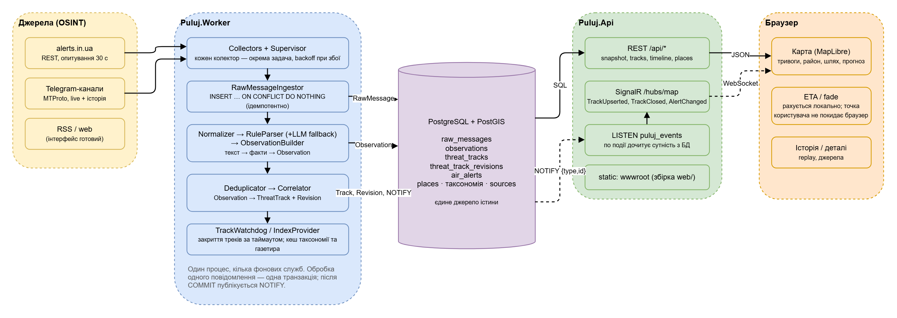

# Puluj

Цивільне ситуаційне оповіщення про повітряні загрози з відкритих джерел: збір повідомлень (alerts.in.ua, Telegram),
нормалізація → `Observation` → `ThreatTrack`, карта з напрямком руху, ETA до вашої точки та повним ланцюжком джерел.
Специфікація — [`Puluj.md`](Puluj.md). Головний принцип: *«Що саме ми показуємо, звідки це взялося і наскільки ми в цьому впевнені?»*

## Документація

Один документ — [`docs/README.md`](docs/README.md): устрій, запуск, джерела, парсер, треки, дані, API, карта/ETA, експлуатація.

## Архітектура




| Проєкт | Призначення |
|---|---|
| `src/Puluj.Domain` | сутності та enum-и (§5–§11 spec) |
| `src/Puluj.Infrastructure` | EF Core + PostGIS, міграції, seed (таксономія, джерела, газетир), ingestion, NOTIFY |
| `src/Puluj.Collectors` | `AlertsInUaCollector`, `TelegramCollector` (WTelegramClient), supervisor з backoff |
| `src/Puluj.Processing` | Normalizer, RuleParser, LlmParser, ObservationBuilder, Correlator, TrackWatchdog |
| `src/Puluj.Worker` | хост збору та обробки (міграції + seed при старті) |
| `src/Puluj.Api` | REST (`/api/*`), SignalR (`/hubs/map`), роздача SPA |
| `web/` | React + Vite + MapLibre; ETA рахується в браузері |
| `data/` | seed: `taxonomy/*.json`, `sources.json`, `gazetteer/regions.json`, `corpus/cases.json` (golden-тести парсера) |

## Швидкий старт (Docker)

```bash
cp .env.example .env            # опційно: токени можна ввести на сторінці ⚙ Налаштування — вони зберігаються в БД
pwsh scripts/gazetteer/download.ps1   # або scripts/gazetteer/download.sh — геодані (~80 MB, не в git)
docker compose -f deploy/docker-compose.yml up --build
# http://localhost:8080  (health: /api/health)
```

## Локальна розробка (без Docker)

Потрібні: .NET 10 SDK, Node 24, PostgreSQL 17 + PostGIS (БД `puluj`, користувач/пароль `puluj`).

```powershell
pwsh scripts/gazetteer/download.ps1        # один раз
pwsh scripts/dev-run.ps1 -ResetDb          # build + міграції/seed + запуск Api (5257) і Worker у фоні
cd web && npm install && npm run dev       # http://localhost:5173 (проксі на API)
python scripts/dev-scenario.py             # демо-ситуація через POST /api/dev/ingest (лише Development)
```

`npm run build` збирає SPA у `src/Puluj.Api/wwwroot`, після чого `http://localhost:5257/` віддає готовий інтерфейс.
`pwsh scripts/dev-run.ps1 -Public` робить це автоматично і відкриває Api на всіх інтерфейсах (`http://<LAN-IP>:5257`) — доступ з інших пристроїв у мережі без Vite; правило firewall для 5257 додається один раз (потрібен запуск від адміністратора).

## Конфігурація (env / appsettings)

| Ключ | Опис |
|---|---|
| `ConnectionStrings__Puluj` | PostgreSQL |
| `Collectors__AlertsInUa__Enabled`, `…__Token` | alerts.in.ua API (polling 30 с) |
| `Collectors__Telegram__Enabled`, `…__ApiId`, `…__ApiHash`, `…__Phone`, `…__SessionPath` | MTProto-сесія; код входу — `…__VerificationCode` або файл `<SessionPath>.code` |
| `Llm__Enabled`, `Llm__Model`, `ANTHROPIC_API_KEY` | LLM fallback парсера (вмикається лише коли правила нічого не знайшли) |
| `Correlation__AttachThreshold` (0.6), `Correlation__DuplicateWindow` (3 хв) | кореляція/дедуплікація |
| `Seed__DataDirectory` | шлях до `data/` (за замовчуванням шукається вгору від content root) |

Канали Telegram та довіра до джерел задаються у `data/sources.json`; таксономія загроз і aliases — у `data/taxonomy/`
(upsert при кожному старті Worker, без змін коду).

## Тести

```powershell
dotnet test tests/Puluj.Processing.Tests          # парсер (golden corpus), корелятор, LLM-мапінг
$env:PULUJ_TEST_CONNECTION="Host=localhost;Port=5432;Database=puluj_test;Username=puluj;Password=puluj"
dotnet test tests/Puluj.Integration.Tests         # end-to-end на реальній PostGIS (або Testcontainers, якщо є Docker)
cd web && npm test                                # ETA / fade
```

Додати новий випадок парсингу = додати запис у `data/corpus/cases.json`.

## API

| Endpoint | Опис |
|---|---|
| `GET /api/snapshot?at=&activeOnly=` | стан карти зараз або на момент `at` (історичний режим, з `ThreatTrackRevision`) |
| `GET /api/tracks/{id}` | трек + усі observations, джерела, оригінальні тексти (provenance chain) |
| `GET /api/timeline?from&to&bucketMinutes` | гістограма для слайдера історії |
| `GET /api/taxonomy`, `GET /api/sources` | довідники (швидкісні профілі, fade) |
| `GET /api/places/search?q=`, `GET /api/places/regions`, `GET /api/places/{id}/geometry` | газетир |
| `GET /api/health` | стан БД і свіжість колекторів |
| `POST /api/dev/ingest` | лише Development: вкинути повідомлення як від колектора |
| SignalR `/hubs/map` | `TrackUpserted`, `TrackClosed`, `AlertChanged` |

## Ліцензії даних

geoBoundaries (ODbL/CC-BY, на основі OSM), GeoNames (CC-BY 4.0), карта — OpenFreeMap / OpenMapTiles / OpenStreetMap.
