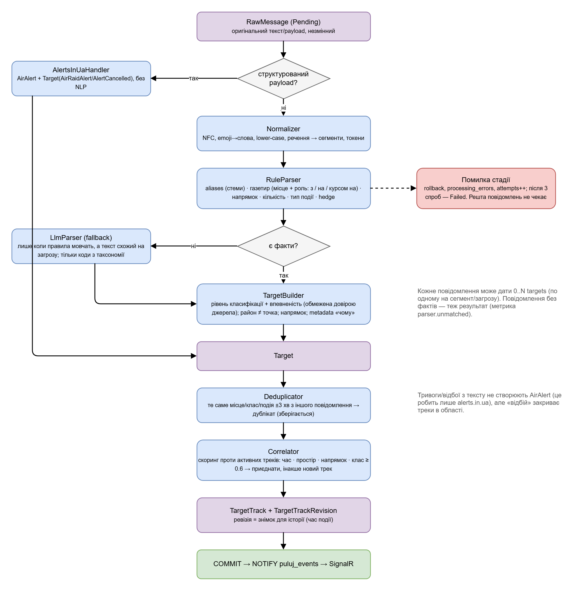
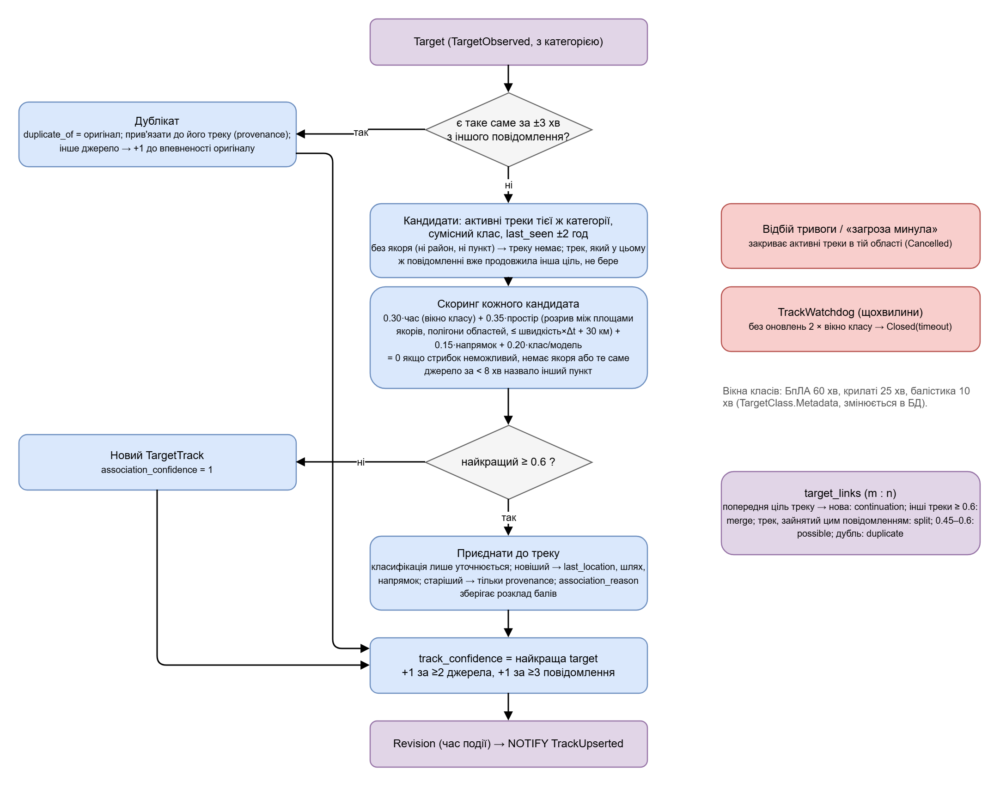
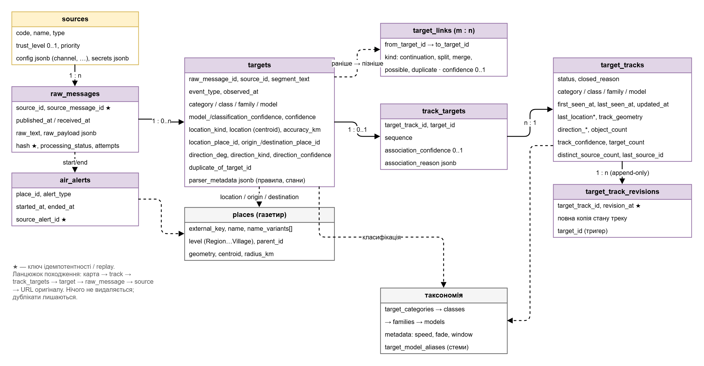
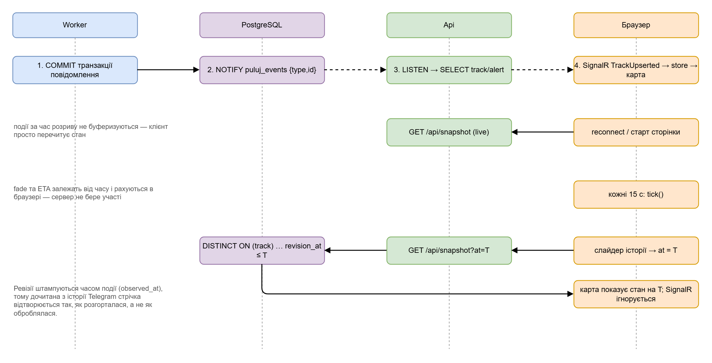

# Puluj — документація

Puluj збирає відкриті повідомлення про повітряні загрози (alerts.in.ua, офіційні та моніторингові Telegram-канали),
розбирає їх на факти, зв'язує факти у треки об'єктів і показує на карті з напрямком, ETA до точки користувача та
повним ланцюжком джерел. Головне правило: система завжди може відповісти, **що** показує, **звідки** це взялося і
**наскільки** вона в цьому впевнена. Специфікація продукту — [`../Puluj.md`](../Puluj.md).

Зміст: [Як влаштовано](#як-влаштовано) · [Запуск і налаштування](#запуск-і-налаштування) · [Джерела](#джерела) ·
[Шлях повідомлення](#шлях-повідомлення) · [Треки](#треки) · [Дані](#дані) · [API](#api) · [Карта і ETA](#карта-і-eta) ·
[Експлуатація](#експлуатація) · [Розширення без коду](#розширення-без-коду)

## Як влаштовано


| Частина | Що робить |
|---|---|
| **Puluj.Worker** | колектори джерел, розбір тексту, дедуплікація, кореляція треків, закриття треків за таймаутом. Один процес, кілька фонових служб; при старті застосовує міграції і seed |
| **PostgreSQL + PostGIS** | єдине джерело істини: оригінальні повідомлення, факти, треки з історією, довідники (таксономія, географія) |
| **Puluj.Api** | REST для карти, SignalR для live-подій, роздача зібраного frontend. Тільки читає БД |
| **web/** | React + MapLibre. ETA та старіння маркерів рахує сам — сервер не знає, де користувач |

Worker → Api зв'язані через Postgres `LISTEN/NOTIFY`: після коміту повідомлення Worker публікує `{type, id}`, Api дочитує
об'єкт із БД і розсилає клієнтам. Ніякого брокера чи Redis.

Проєкти: `src/Puluj.Domain` (сутності), `Puluj.Infrastructure` (EF Core/PostGIS, міграції, seed, NOTIFY, ingestion),
`Puluj.Collectors`, `Puluj.Processing` (парсер, кореляція), `Puluj.Worker`, `Puluj.Api`, `Puluj.Contracts` (DTO);
`web/`; `data/` (seed-файли); `tests/`.

## Запуск і налаштування

Потрібні .NET 10, Node 24, PostgreSQL 17 + PostGIS (БД `puluj`, користувач/пароль `puluj`) або Docker.

```powershell
pwsh scripts/gazetteer/download.ps1   # один раз: полігони областей (geoBoundaries) + населені пункти (GeoNames), ~80 MB, не в git
pwsh scripts/dev-run.ps1 -ResetDb     # build, міграції + seed, Api :5257 і Worker у фоні (логи в %TEMP%\puluj-*.log); -Stop зупиняє
cd web; npm install; npm run dev      # http://localhost:5173 (проксі на Api)
python scripts/dev-scenario.py        # демо-ситуація через POST /api/dev/ingest (лише Development)
```

Production: `cp .env.example .env`, заповнити токени, `docker compose -f deploy/docker-compose.yml up --build` → http://localhost:8080.
`npm run build` кладе frontend у `src/Puluj.Api/wwwroot`, і Api віддає його на `/`.
`dev-run.ps1 -Public` збирає SPA і біндить Api на `0.0.0.0:5257` (доступ з LAN, друкує `http://<LAN-IP>:5257`); правило firewall додається один раз, потрібні права адміністратора. Сторінка налаштувань ззовні працює лише після того, як задати `Admin:Token` з localhost.

Тести: `dotnet test` (парсер на golden-корпусі, кореляція, LLM-мапінг; інтеграційний — з `PULUJ_TEST_CONNECTION=<рядок до тестової БД>`
або Docker/Testcontainers), `cd web && npm test` (ETA).

**Сторінки.** `/` — карта України (області, тривоги, треки, стрічка повідомлень справа; клік по області підсвічує її
і фільтрує стрічку). `#/kyiv` — окрема карта Києва з 10 районами (полігони з OSM, `scripts/gazetteer/download-kyiv.py`)
і ~50–80 км околиць, щоб було видно вектори, які заходять у місто; тривоги по районах (жовтий/червоний рівень з
повідомлень КМВА/ОВА), список районів зліва зі станом і кількістю повідомлень за годину.

**Відтворення історії** — кнопка ⏱ у верхній панелі на будь-якій сторінці: вікно 1–24 год до вибраного моменту,
гістограма повідомлень/тривог, повзунок, ▶/⏸ зі швидкістю 1–60 хв/с, кроки ±1 хв (←/→, Shift — ±10), Home/End, Esc —
вихід. Кожна позиція — `GET /api/snapshot?at=` (стан треків з ревізій, тривоги на той момент); стрічка показує лише те,
що вже було повідомлено на момент курсора, останні 3 хв підсвічені. Події SignalR у цьому режимі ігноруються.

**Сторінка налаштувань** — кнопка ⚙ у верхній панелі (або `#/settings`): токен alerts.in.ua з перевіркою (зберігається на
самому джерелі, колонка `sources.secrets`, у браузер ніколи не повертається — лише «збережено/не задано»), Telegram
(api_id/api_hash/телефон, код входу вводиться там само), LLM-ключ, джерела (увімкнути/вимкнути, додати канал, довіра,
пріоритет, інтервал, домашній регіон), адмін-токен, поріг кореляції. Значення зберігаються в таблиці `app_settings` і
**перекривають** файли/env; Worker перечитує їх кожні 5 с і перезапускає колектори без рестарту процесу. Поки
`Admin:Token` не задано, сторінка доступна лише з localhost; секрети ніколи не повертаються назад у браузер.

Ті самі ключі можна задати в `appsettings.json` Worker-а або змінними `Section__Key`:

| Ключ | Типово | Опис |
|---|---|---|
| `ConnectionStrings__Puluj` | localhost | PostgreSQL |
| `Collectors__AlertsInUa__{Enabled,Token,PollingInterval}` | off, —, 30 с | alerts.in.ua (`Token` — лише запасний, якщо на джерелі немає свого) |
| `Collectors__Telegram__{Enabled,ApiId,ApiHash,Phone,Password,VerificationCode,SessionPath,AutoJoin,BackfillLimit}` | off | MTProto-сесія |
| `Llm__{Enabled,Model,TimeoutSeconds,MaxCallsPerMinute}` + `ANTHROPIC_API_KEY` | off, claude-opus-5, 20, 20 | LLM fallback парсера |
| `Correlation__{AttachThreshold,SlackKm,DuplicateWindow,CloseAfterWindows}` | 0.6, 30, 3 хв, 2 | кореляція (див. нижче) |
| `Processing__{MaxAttempts,PendingPollInterval}` | 3, 10 с | повтори обробки, sweeper |
| `Seed__DataDirectory` | `data` | шукається вгору від content root |

## Джерела

**База даних — власник джерел.** `data/sources.json` лише додає джерела, кодів яких ще немає в таблиці `sources`; усе, що
змінено на сторінці налаштувань (назва, довіра, пріоритет, канал, інтервал, домашній регіон, токен API), переживає будь-який
рестарт. Секрети джерела (`sources.secrets`, jsonb) пише лише адмін-API, читає лише колектор; зміна токена перезапускає
колектор (`CollectorSupervisor` порівнює сигнатуру джерел разом із секретами).

Список — `data/sources.json` (upsert по `code` при старті Worker): `type`, `trustLevel` 0..1 (стеля впевненості для фактів
з цього джерела), `priority`, `enabled`, `config` (для Telegram — `channel`). Секретів там немає.

**alerts.in.ua.** Токен видають за запитом на alerts.in.ua/api-request. Колектор опитує `active.json` кожні 30 с; кожен
початок і кінець тривоги стає окремим `RawMessage`; поточний набір активних тривог зберігається в `collector_states.cursor`,
тому «кінці», що сталися під час простою Worker-а, дописуються після рестарту.

**Telegram — це не бот.** Бот бачить лише чати, куди його додав адміністратор, і не читає публічні канали ПС ЗСУ чи ОВА.
Тому використовується сесія звичайного акаунта (WTelegramClient, MTProto), яка підписується на канали як Telegram Desktop:

1. окремий акаунт з окремою SIM (не особистий);
2. https://my.telegram.org → API development tools → `api_id`, `api_hash`;
3. `Collectors__Telegram__Enabled=true`, `ApiId`, `ApiHash`, `Phone=+380…`, `Password` (лише при 2FA);
4. перший запуск: у лозі Worker `Telegram asks for the login code…` — код вписати у `Collectors__Telegram__VerificationCode`
   або у файл `<SessionPath>.code` (Worker чекає до 10 хв). Далі сесія живе у файлі (у Docker — volume `tgsession`);
5. `AutoJoin` підписує акаунт на канали з `sources.json` (без підписки live-оновлення не приходять), `BackfillLimit` дочитує
   останні пости при старті. Редагування поста зберігається окремим `RawMessage` — оригінал не перезаписується.

**LLM fallback** (опційно): `Llm__Enabled=true` + `ANTHROPIC_API_KEY`. Викликається лише коли правила не знайшли жодного
факту, а текст містить слова-тригери («загроз», «курс», «пуск», «ракет»…). Відповідь — structured output за схемою; модель
може повертати лише коди з таксономії, невідомі місця відкидаються, ніщо не вигадується. Без ключа тихо вимкнено.

## Шлях повідомлення



На прикладі поста «Шахеди на Чернігівщині курсом на Київщину.»:

1. **RawMessage.** Колектор зберігає оригінал: текст, час публікації, посилання, payload. Запис незмінний. Ключі
   ідемпотентності — `(джерело, id повідомлення)` і хеш вмісту, тому повтори нічого не змінюють. Рядок має статус `Pending`;
   ProcessingLoop бере його з in-process черги, а sweeper кожні 10 с добирає `Pending` з БД — рестарт нічого не губить.
2. **Нормалізація.** NFC, емодзі → слова (`🛵` → «шахед», `🔴` → «тривога»), нижній регістр, речення → сегменти, токени.
   Припущення: один сегмент — один факт (плюс по факту на кожну окрему загрозу в сегменті).
3. **Правила** (`RuleParser`), усе на стемах — токен збігається, якщо починається зі стема і має ≤ 4 літер флексії:

   | Що | Як | У прикладі |
   |---|---|---|
   | загроза | aliases з БД: «шахед» → сімейство, «shahed-136» → модель; при перекритті — довший/точніший | сімейство **SHAHED** |
   | місце та роль | газетир (області, міста з відмінками) + прийменник: «з …» = звідки, «курсом на / у напрямку …» = куди, «на …щині / над / у районі» = тут; «на Київщину» (знахідний) — куди | тут **Чернігівська обл.**, куди **Київська обл.** |
   | напрямок | компасні слова, «з півночі» = розворот на 180°; інакше bearing тут → куди (позначається як «за пунктом призначення») | ~223° |
   | кількість | «5», «5х», «два», «група/декілька» (≈3), «до 10» (≈) | — |
   | тип події | «відбій тривоги», «загроза минула», «вибухи», «працює ППО»; інакше — спостереження цілі | спостереження |
   | hedge | «ймовірно», «можливо», «?» → впевненість −1 рівень | — |

   Списки: «Шахеди:» у заголовку застосовується до наступних рядків; «Балістика! / Дніпро — в укриття!» — загроза
   переноситься на наступний сегмент із місцем. «На півночі Київщини» зсуває точку в межах області, лишаючи тип «область».
4. **Target.** Класифікація рівно того рівня, який дав текст (сімейство, а не вигадана модель); упевненість alias-а
   обмежена довірою джерела; локація — центроїд району з радіусом і `LocationKind = Region` (точкою це не малюється);
   напрямок із упевненістю; `parser_metadata` пояснює, які правила спрацювали. Структуровані payload-и alerts.in.ua минають
   NLP: одразу `AirAlert` + факт з упевненістю `Confirmed`.
5. Далі — [треки](#треки). Помилка на будь-якій стадії відкочує транзакцію повідомлення, пише `processing_errors`, `attempts++`;
   після 3 спроб — `Failed`, решта повідомлень не чекає.

Якість парсера міряється golden-корпусом `data/corpus/cases.json` (35 кейсів): кожен запис — текст і очікувані факти,
тест перевіряє лише вказані поля. Новий формат повідомлень = новий кейс + правка правила.

## Треки



**Дублікат**: той самий район, клас і подія за ±3 хв з іншого повідомлення. Зберігається як Target з `duplicate_of`,
прив'язується до треку оригіналу (provenance), інше джерело підвищує впевненість оригіналу. Стан треку не змінює.

**Списки під заголовками областей** («Сумщина:» … «БпЛА курсом на Кириківку»): рядок, що складається лише з назви області,
відкриває секцію (`RuleParser`, `sectionRegion`). Назви пунктів у секції розв'язуються на користь цієї області; село чи
містечко, яке є лише в інших областях, не прив'язується (це тезка), а факт без відомого пункту локується в області
секції (`section_region`). Кожен рядок — окремий об'єкт: факти з одного повідомлення ніколи не потрапляють в один трек
(`CorrelationSink`, `usedTracks`).

**Бік підльоту.** Курс до названого пункту рахується не від центру області чи міста, а від найближчої ворожої території
(`GazetteerIndex.ApproachBearingTo`: полігони РФ і Білорусі з газетиру). «Київ: БпЛА курсом на Троєщину» ставить
об'єкт за 15 км від Троєщини з боку Білорусі з курсом на неї (`TargetBuilder.ApproachAnchor`, `DirectionOnly`);
так само трек із фактом лише про призначення. Газетир тепер містить усі населені пункти GeoNames (~34 тис.), тому
для сіл з населенням < 500 назва береться лише після прийменника чи маркера («на», «біля», «курсом на», «н.п.») або
під заголовком своєї області.

**Зв'язки між цілями** (`target_links`, many-to-many, спрямовані «раніше → пізніше»): після кожної кореляції
попередня ціль обраного треку → нова (`Continuation`, оцінка асоціації); інші треки з оцінкою ≥ порогу → нова (`Merge`:
кілька груп зійшлись в одну), трек, який у цьому ж повідомленні вже продовжила інша ціль → нова (`Split`: група
розпалась на частини); оцінка в [0.45; поріг) → `Possible`; дубль → `Duplicate` (1.0). Так дрон, що перелетів із
Чернігівщини на Київщину, лишається зв'язаним із попередніми повідомленнями навіть через межу треків. У панелі деталей
кожна ціль показує свої зв'язки («← #123 продовження 82%», «→ #130 розділення»).

**Просторовий якір** (`SpatialAnchor`): факт із районом — його місце; факт лише з пунктом призначення («1 БпЛА на Конотоп») —
підхід до цього пункту (радіус ≥ 40 км, `DestinationAnchorKm`); факт без того й іншого **не отримує треку** (лишається у стрічці).
Області та зони несуть свій полігон (`PlaceEntry.Boundary`), тому «розрив» між якорями — це відстань між самими площами
(0, якщо вони перетинаються), а не між центроїдами мінус радіуси: місто за 30 км від межі області не «всередині» неї лише тому,
що радіус, який покриває область, — 150 км.

**Кореляція**: кандидати — активні треки тієї ж категорії з сумісним класом, `last_seen` ±2 год. Бал кожного:

```
time      = 1 − Δt / вікно класу                     (БпЛА 60 хв, крилаті 25, балістика 10)
gap       = відстань між площами якорів (0, якщо перетинаються);  reach = v_max·Δt + 30 км
space     = 1 − 0.5·gap / reach;  0, якщо gap > reach або в одного боку немає якоря
direction = 1 − Δкут / 180                            (0.5, якщо напрямок невідомий)
class     = 1 та сама модель · 0.9 те саме сімейство · 0.7 один бік неконкретний · 0.2–0.3 різні моделі/сімейства
total     = 0.30·time + 0.35·space + 0.15·direction + 0.20·class
```
`total ≤ 0.3` (не приєднувати), якщо `space = 0` або **те саме джерело** за < 8 хв назвало інший пункт (район чи призначення),
до якого об'єкт не міг долетіти — джерело перелічує різні об'єкти. Приєднання при `total ≥ 0.6` (`AttachThreshold`), інакше
новий трек. Розклад балів (`gapKm`, `maxDistanceKm` = reach) зберігається в `target_track_targets.association_reason`.

**Оновлення треку**: класифікація лише уточнюється (сімейство → модель), новіший факт рухає останній район, шлях і напрямок,
старіший (out-of-order) лише додає provenance. `track_confidence` = найкраща впевненість факту, +1 за ≥ 2 джерела,
+1 за ≥ 3 повідомлення (не вище High). Факт лише з призначенням («курсом на Конотоп») переносить маркер треку на підхід до пункту
(`LastLocationKind = DirectionOnly`, радіус ≥ 40 км, на карті — бліда піктограма) незалежно від того, де трек був;
точна попередня фіксація ще дає курс на пункт (Low), груба (область) — ні. **Шлях** (`track_geometry`) складається лише з фактів: точних позицій (≤ 50 км) або грубих, коли площі попередньої й
нової не перетинаються; лінія між центроїдами двох сусідніх областей — не маршрут, тому її немає, як і напрямку з неї.

**Закриття**: «відбій тривоги» / «загроза минула» в області закриває її треки (`Cancelled`); `TrackWatchdog` щохвилини
закриває треки без оновлень 2 × вікно класу (`Closed`, `timeout`).

**Ревізії**: після кожної зміни — повний знімок треку в `target_track_revisions` з часом **події** (не обробки). Стан на момент
T = остання ревізія кожного треку з `revision_at ≤ T` — так працює історичний режим, і дочитана з Telegram історія
відтворюється так, як розгорталася.

## Дані



| Таблиця | Зміст |
|---|---|
| `sources` | джерела, довіра, конфіг колектора |
| `raw_messages` | оригінали; `(source_id, source_message_id)` і `hash` унікальні; `processing_status`, `attempts` |
| `targets` | факти: подія, рівні класифікації + упевненості, локація (тип, місце, центроїд, радіус), напрямок, `duplicate_of`, `parser_metadata` |
| `target_tracks` / `target_track_targets` / `target_track_revisions` | треки, зв'язки з балами, знімки для історії |
| `air_alerts` | інтервали тривог по областях (лише зі структурованих джерел) |
| `places` | газетир: області/зони (полігони), населені пункти (точки), варіанти назв-стемів, радіус |
| `target_categories → classes → families → models`, `target_model_aliases` | таксономія з `metadata` (швидкість, fade, вікно кореляції) та словник назв |
| `collector_states`, `processing_errors` | курсори/здоров'я колекторів, помилки |

Ланцюжок походження: карта → трек → зв'язки → факти → оригінали → джерело → URL. Нічого не видаляється.
Схема — одна міграція; зміна моделі EF → `scripts/add-migration.ps1 <Name>`.

## API

| Endpoint | Що повертає |
|---|---|
| `GET /api/snapshot?at=&activeOnly=` | стан карти зараз (треки + тривоги) або на момент `at` з ревізій (`historical: true`) |
| `GET /api/tracks/{id}` | трек і всі його факти з джерелом, довірою, текстом оригіналу, посиланням, балом зв'язку |
| `GET /api/timeline?from&to&bucketMinutes` | гістограма для повзунка відтворення |
| `GET /api/targets?since&until&limit` | стрічка спостережень (новіші перші); `until` — для вікна відтворення |
| `GET /api/taxonomy`, `/api/sources` | довідники; в таксономії — швидкості, fade, `displayMode` |
| `GET /api/places/search?q=`, `/api/places/regions`, `/api/places/{id}/geometry` | пошук пункту (лише центроїд), полігони регіонів і районів Києва (кеш 1 год) |
| `GET /api/health` | БД + свіжість колекторів: `ok` / `stale` (немає успіху > 3× інтервалу → `Degraded`) / `idle` (колектор вимкнено) |
| `/api/admin/*` | сторінка налаштувань: `settings` (GET/PUT), `status`, `sources` (GET/POST/PUT/DELETE), `telegram/code`, `test/alerts`; заголовок `X-Admin-Token` |
| `POST /api/dev/ingest` | лише Development: вкинути повідомлення чи payload тривоги як від колектора |
| SignalR `/hubs/map` | `TrackUpserted`, `TrackClosed`, `AlertChanged` (аргумент — той самий DTO, що й у snapshot) |

`TrackDto`: `target` (коди/назви всіх рівнів, `label` найглибшого, `displayMode`, `fadeMinutes`, `speedProfile`),
`modelConfidence`, `trackConfidence`, `lastLocation {kind, placeId, placeName, point, accuracyKm}`, `trackGeometry`,
`direction {degrees, kind: Compass|TowardsPlace, confidence}`, `targetCount`, `distinctSourceCount`. JSON camelCase,
`null` пропускаються, геометрія — GeoJSON.



Після розриву з'єднання клієнт перечитує snapshot — події не буферизуються. У режимі історії події ігноруються.

## Карта і ETA

`web/src`: `api/` (типи, fetch, SignalR), `store/useStore.ts` (zustand: треки, тривоги, фільтри, точка, тема, режим),
`map/` (GeoJSON-шари, MapLibre), `eta/`, `components/`. Кожні 15 с `tick()` перераховує fade і ETA.

Шари: тривоги — заливка області; «останній відомий район» — полігон області з пунктирним контуром (не точка);
**сліди** — попередні повідомлені позиції цілі (`TrackDto.fixes`: останні 4 різні місця з часом, у т.ч. «на підході до X»), бліді гліфи з підписом «місце час», з'єднані крапковою лінією з маркером; для виділеної цілі завжди, для всіх — прапорець «Сліди всіх цілей»; у попапі й панелі — ланцюжок «Ромни 21:40 → на Конотоп 21:52 → зараз: Кролевець»; **прогноз** — короткий (6 хв, ≥ 8 км) пунктир кольору класу без ореолу
у заявленому напрямку всередині заштрихованого сектора (`fill-pattern`), ширина сектора — за впевненістю курсу (±12° High …
±28° Low), шеврон на кінці (факт і прогноз завжди виглядають по-різному); маркер-стрілка за курсом, блідне за профілем класу
(за часом життя позначки, див. нижче), бліда — «на підході до пункту» (позиція приблизна). **Бейджі** біля маркера:
синій — кількість джерел (`sourceIds`), білий «×N» — цілей у групі. Клік по піктограмі, бейджу, хвосту, пунктиру чи сектору
(`TRACK_HIT_LAYERS`) виділяє трек (гліф перефарбовується в колір виділення теми з обвідкою кольору класу; одна ціль за раз), а цілі
з того самого повідомлення (`TrackDto.messageIds`, останні 6 повідомлень треку) отримують важку обвідку як «сусіди»; і відкриває
компактний **попап у точці кліку** (`TrackPopup`: тип/модель, «N хв тому», курс, ETA, бейджі, 3 останні повідомлення) →
«Деталі» → **ліва панель** (`TrackDetailsDrawer`) з повним провенансом, яка лишається відкритою і слідує за виділенням.
Ліва панель згортається (кнопка ‹ або ☰, стан у `localStorage`); фільтри: класи, тривоги, лише активні, **хвіст / прогноз**
окремо, **джерела** (трек показується, якщо про нього повідомляє хоча б одне вибране; стрічка й попап фільтруються так само).
**Час життя позначки** (панель, типово 15 хв, `filters.lifetimeMinutes`): ціль показується, поки після її останнього
повідомлення минуло не більше цього часу, і блідне до 0.45 протягом нього; профіль класу (`fadeMinutes`) далі впливає лише на
ETA («дані застарілі» після 2×). **Теми** (◐ у верхній панелі, `THEMES` у store): світла, сепія (світлі), графіт (темні панелі над світлою
картою), темна, опівнічна, олива (темні). Кожна тема має власну палітру карти (`map/palette.ts`, `MapPalette`):
кольори класів для піктограм і векторів, заливки тривог (жовтий і червоний рівні — свої відтінки в кожній темі),
суша, кордони, кластери, підсвітка; зміна теми перевантажує стиль карти й перемальовує гліфи — палітра в `index.css` як перевизначення змінних Tailwind (`--color-slate-*`) під `html[data-theme]`,
темні теми додають клас `dark` і темну підкладку карти.
**Вікно області** (`RegionPopup`, у точці кліку по області без цілі): поточна тривога (тип, рівень, початок, тривалість)
або коли закінчилась остання, і кількість та сумарний час тривог за добу (`GET /api/alerts/history?placeId=&hours=24`).
**Стрічка** підсвічує повідомлення виділеної цілі (`TargetDto.trackId`) і позначає в тексті сегмент, з якого
побудовано факт (`Highlight`, у згорнутому рядку — сегмент із контекстом); рядки сусідів по повідомленню — світлішою смужкою.
Кластеризація маркерів лишилась тільки для практично збіжних точок (радіус 6 px до зуму 10), щоб сусідні пункти не
згортались в один кружок.
Точка користувача: пошук пункту, клік на карті або геолокація за кліком; зберігається лише в `localStorage`. Із заданою
точкою — прапорець **«підсвічувати цілі»**: червоне кільце — ціль поруч (≤ 25 км, для області — всередині полігона або
≤ 25 км від його краю), помаранчеве — ETA рахується, тобто курс у ваш бік.

**ETA** (`web/src/eta/computeEta.ts`, тести `npm test`) рахується в браузері з `TrackDto`:

```
disabled, якщо !speedProfile.etaEnabled (балістика, авіація) · noLocation, якщо район невідомий · stale, якщо минуло > 2×fade
d = відстань до центроїда;  d_edge = відстань до краю полігона області (0 всередині), якщо полігон відомий
якщо (d_edge > 0, або без полігона d > accuracy) і |bearing→я − курс| > 45° → «не у вашому напрямку»
eta_min = (d_edge, або max(0, d − accuracy)) / v_max − elapsed;   eta_max = (d + accuracy) / v_min − elapsed
округлення до 5 хв: «~15–25 хв», або «< 5 хв (до ~N)», або «ймовірно вже минув»
упевненість = упевненість курсу (без курсу — Low), −1 для області/зони, −1 якщо elapsed > fade
```
Ніколи не «11 хв 37 с» і ніколи не координати на сервер. Серверний варіант (передобчислення до міст для push) має
повторювати цей алгоритм.

## Експлуатація

**Логи** (Serilog, JSON у Production): `RawMessage N (<source>): K target(s)`; `no facts in "…"` — правила не
впізнали текст; `Track N opened` / `attached to track N (score)` / `closed (reason)`; `RawMessage N failed`;
`Collector <name> crashed; restarting in …` (backoff 5 с → 5 хв, інші колектори не зачіпаються).

**Метрики** (OpenTelemetry, meter `Puluj`, експорт OTLP): `puluj.rawmessages.received{source}`,
`puluj.source.latency{source}` (received − published), `puluj.targets.created{source,method}`,
`puluj.parser.unmatched{source}`, `puluj.processing.errors{stage}`, `puluj.llm.calls{outcome}`.

| Симптом | Куди дивитись |
|---|---|
| повідомлення є, маркера нема | `raw_messages.processing_status`, `processing_errors`, лог `no facts` → додати alias / кейс у корпус |
| об'єкти злилися або розпалися | `target_track_targets.association_reason`; `Correlation__AttachThreshold`, `SlackKm` |
| модель визначена надто впевнено | `targets.identification_source` — який alias; його `confidence` у seed |
| тривога не з'являється / не зникає | `air_alerts`, `collector_states`, `/api/health`; лог `unknown location` → `regions.json` |
| порожня карта після рестарту | геодані не завантажені (`Gazetteer: 0 settlements`); Api стартував раніше за seed — перечитає за 15 с |
| `dotnet build`: DLL locked | `scripts/dev-run.ps1 -Stop` |

Перепроцесинг після покращення парсера: скинути `processing_status = 0, attempts = 0` для потрібних повідомлень і
видалити похідні (факти, треки, ревізії) за той період — оригінали незмінні, sweeper обробить заново.

## Розширення без коду

| Хочу | Файл | Далі |
|---|---|---|
| додати канал / змінити довіру | `data/sources.json` | рестарт Worker |
| нова назва загрози | `data/taxonomy/aliases*.json`: `{alias (стем), target: "family:SHAHED", lang, confidence, exact?, priority?}` | рестарт Worker + кейс у `data/corpus/cases.json` |
| нова модель / швидкість / fade / вікно кореляції | `data/taxonomy/models.json`, `taxonomy.json` (`metadata`) | рестарт Worker; клієнт бере з `/api/taxonomy` |
| розмовна назва області, нова акваторія | `data/gazetteer/regions.json` | рестарт Worker |
| емодзі-позначення каналу | `Normalizer.EmojiWords` (єдине місце в коді) | збірка |

Aliases і місця, видалені з seed-файлів, видаляються і з БД при наступному старті. Діаграми — `diagrams/build.py`
(→ `.drawio` → `export.mjs` → `.png`), див. `diagrams/README.md`.
